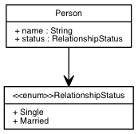

# Umlaut

[](https://clojars.org/umlaut)
[](https://clojars.org/lein-umlaut)

Umlaut is a schema language used to describe - in a neutral fashion - any data
relationship domain.

Umlaut's unique design allows it to have several pluggable generators that can be used to
generate target schema definitions in the language you want. The benefit here is that you
write your schema once and consume it in as many places as needed having one single source
of truth.

## Table of Contents

* [Getting Started](#getting-started)
* [Recommended Dependencies](#recommended-dependencies)
* [Usage](#usage)
* [Schema Language](#schema-language)
* [Annotations](#annotations)
* [Diagram Generator](#diagram-generator)
* [Lacinia Generator](#lacinia-generator)
* [Spec Generator](#spec-generator)
* [Datomic Generator](#datomic-generator)
* [List of Reserved Words](#list-of-reserved-words)
* [Bugs](#bugs)
* [Help!](#help)

## Getting Started

### Option 1: As a lein plugin

The recommended approach is to use Umlaut via the `lein-umlaut` plugin on your lein
`profiles.clj` file (`~/.lein/profiles.clj`). This will make sure that the Umlaut lein
plugin is available globally for your usage:

```clojure
{:user {:plugins [[lein-umlaut "0.1.4"]]}}
```

Then simply run from anywhere:

```
$ lein help umlaut
```

During the first execution there will be a few dependencies installed and then yuo should see
the usage help.

### Option 2: As a project dependency

If you need to use Umlaut as part of your project, add the following line to your
`project.clj` dependencies (situations where you would need this setup are such that you need to
generate code as part of your project - i.e. reading an Umlaut file as part of your
system's bootstrap and injecting a generated schema as part of initialization of a DB or
any other system):

[](http://clojars.org/umlaut)

If you need to use Umlaut as a plugin to your project, add the following line to your
`project.clj` plugins (situations where you would need this setup are those where you are using
the Umlaut lein plugin for a single project and want to make sure that all other developers
in the project have access to it):

[](http://clojars.org/lein-umlaut)

Then simply run from your project directory:

```
$ lein help umlaut
```

## Recommended Dependencies

Umlaut can generate nice visual renderings of your schema by using GraphViz. We recommend
[installing Graphviz](http://www.graphviz.org/) if you intend to use this feature of Unmlaut.

## Usage

### Usage as a CLI

All files ending with `.umlaut` inside the input folder will be considered.

To create `.dot` (Graphviz) versions of your schema:

```
$ lein umlaut dot [umlaut-files-folder] [output-folder]
```

If you have `dot` installed, Umlaut will also create `.png` renderings.

To create a GraphQL schema:

```
$ lein umlaut graphql [umlaut-files-folder] [output-file]
```

To create a lacinia EDN schema:

```
$ lein umlaut lacinia [umlaut-files-folder] [output-file]
```

To create `clojure.spec` files:

```
$ lein umlaut spec [umlaut-files-folder] [output-folder] [spec-package] [custom-validators-filepath] [id-namespace]
```

For further details run `$ lein help umlaut`


### Usage as a Library

Every generator implements a `gen` method. You can either dig into the source code at
`umlaut/src/generators` or check the documentation below for:

* [Diagram Generator](#diagram-generator)
* [Lacinia Generator](#lacinia-generator)
* [Spec Generator](#spec-generator)
* [Datomic Generator](#datomic-generator)

## Schema Language

Umlaut expects to receive an `umlaut` schema file. An `umlaut` schema is general-purpose schema
definition language that has been designed to provide support for generating models in several
different languages in a flexible way.

Let's go over `umlaut`'s syntax and characteristics.


### General

The primitive types are: `["String" "Float" "Integer" "Boolean" "DateTime", "ID"]`. If an
attribute has a type that is not primitive, it must be properly declared.

If you try to declare an attribute that is not primitive or declared, an error will be thrown.

By default, all declared fields are *non-null*. Nullable fields must have the symbol `?` after
the attribute type.

Identifiers are validated by this regex: `[_A-Za-z][_0-9A-Za-z]*` and they can't be any of the
reserved words listed on "List of reserved words" below.

### Attributes and methods

Inside of types and interfaces you can declare fields.

A "field" can either be a method or an attribute:

A field without parameters is considered a simple attribute and is declared like this:

```
attributeIdentifier: type
```

Example:

```
name: String
```

To represent a method, simply declare a field with parameters, like this:

```
methodIdentifier(arg1Identifier: type, ..., arg2Identifier: type): type
```

Example:

```
weight(unit: UnitType): Float
```

All fields must have a type (primitive or not). You can add arity after the type to
indicate a collection of items of that same type, like this:

 ```
 attributeIdentifier: type[min..max]` or `methodIdentifier(...): type[min..max]
 ```

And `n` can be used to indicate inifinity.

Example:

```
employees: Employee[1..n]
```

Umlaut also accepts exact arity. Examples:

```
exactlyFourEmployees: Employee[4]
oneToFourRmployees: Employee[1..4]
```

 You can use the optional modifier `?` after anyone of the types to indicate a
 nullable field.

Example:

```
reportTo: Employee?
```

A few more examples compiled together:
```
  firstName: String
  middleName: String?
  lastName: String  // This is a comment in the schema source code
  dob: DateTime {
    @doc "This is a documentation comment in the dob field"
  }
  age: Float
  friends: String[0..n]
  setFirstName(name: String): String
  computeAge(dateOfBirth: DateTime, today: DateTime): Integer
```

### The type keyword

You can define new types by using the `type` reserved word.

```
type Person {
  id: ID
  name: String
  friends: String[0..n]
  isEmployed: Boolean
  email: String?
}
```

Notes:

- `friends` is an example of a collection.
- `email` is a nullable attribute.
- All attributes are primitives in this example.
- All fields are mandatory except for `email`
- The list of reserved words should be observed before naming a type.

### The interface keyword

You can declare an `interface`, usually to create composition of models.

```
interface Person {
  id: ID
  name: String
  email: String?
}

interface Human {
  temperature: Float
}

type Employee : Person Human {
  salary: Float
  changeSalary(newSalary: Float): Float
}
```

- `umlaut` supports single/multiple inheritance, in this example `Employee` inherits from `Person` and `Human`. So `Employee` will have all the fields of its parent types, plus its own.
- An interface cannot inherit fields from other interfaces.
- A type can only inherit fields from an interface.
- Inheriting from multiple interfaces (multiple inheritance) is allowed.
- The list of reserved words should be observed before naming an interface.

### The enum keyword

You can create enums like this:
```
enum RelationshipStatus {
  SINGLE
  MARRIED
}

type Person {
  name: String
  status: RelationshipStatus
}
```

- Enums can also be used to create GraphQL unions, in order to do that, you need to add an annotation:
`@lang/lacinia identifier union` above the enum definition. In that case, the contents of the enum need to be other custom types.
- The list of reserved words should be observed before naming an enum.


## Annotations

Annotations add extra metadata to your model and are either used for documentation purposes
or can be used by the generators. Generators tend to use these annotations to know how you
want your schema to be interpreted in that target environment.

Annotations have one of these two forms:

- `@<space> <key> [value]`
- `@<space> [value]`

The second format is used only for documentation purposes.

You can provide more than one value to the `[value]` in this syntax. However, this is only
useful given a generator requirement.

In the example below we are telling the Lacinia generator (`@lang/lacinia`) that its `identifier`
key for the type `QueryRoot` is `query`:

```
@lang/lacinia identifier query
type QueryRoot {
  friend: Person[0..n]
}
```

You can document your schema using the `@doc` space. This can be done above the
type/interface/enum definition, like this...

```
@doc "This is my new type"
type MyType {
  ...
}
```

... or as a part of the field annotations like this...

```
@doc "This is my new type"
type MyType {
  myField: String {
    @doc "This is the comment of field a inside type MyType"
  }
}
```

## Diagram Generator

Umlaut uses Graphviz to create diagram images of your schema. Whenever the diagram generator
is activated, at least a file `all.png` will be created containing all your schema models.

In order to build a specific diagram, you can use the `diagram` keyword in the umlaut file:

```
enum RelationshipStatus {
  SINGLE
  MARRIED
}

type Person {
  name: String
  status: RelationshipStatus
}

diagram filename {
  (Person)!
}
```

The above example generates this diagram:



- A file named `all.png` is always created with all the types defined in the umlaut document.
- The file created is `filename.png` because of the identifier in the `diagram` keyword.
- The diagram includes the `RelationshipStatus` box because of the `!` used in the `(Person)` group. This tells umlaut to recursively draw all entities that are dependencies for the entity `Person`. If the `!` was omitted, the diagram would have a single `Person`.
- You can have as many diagrams definitions/combinations as you want, just give them different names.

You can specify the colors of a box this:

```
@lang/dot color <color>
```

The available colors are defined here: http://www.graphviz.org/doc/info/colors.html
This annotation needs to be above the definition of a type/enum/interface.

To use this generator you must have [graphviz](http://www.graphviz.org/) installed.
This package is available for Mac via [Homebrew](http://brewformulas.org/Graphviz) and Windows
via [direct download](http://www.graphviz.org/Download_windows.php).


## Lacinia Generator

Lacinia is a GraphQL framework for Clojure. It uses an [EDN](https://github.com/edn-format/edn)
file with all the types, queries, inputs, mutations, subscriptions, and enums of your schema.

Umlaut will generate the EDN expected by Lacinia.

```
enum RelationshipStatus {
  SINGLE
  MARRIED
}

type Person {
  name: String?
  status: RelationshipStatus
  salary: Float {
    @doc "The annotation below assigns the resolve-salary resolver to the salary field"
    @lang/lacinia resolver resolve-salary
  }
}

@lang/lacinia identifier query
type QueryRoot {
  friends: Person[0..n]
}
```

Will generate:

```
{:objects
 {:Person
  {:fields
   {:name {:type String},
    :status {:type (non-null :RelationshipStatus)},
    :salary {:type (non-null Float), :resolver :resolve-salary}},
   :implements []},
  :Profession
  {:fields {:name {:type (non-null String)}}, :implements []}},
 :enums {:RelationshipStatus {:values ["SINGLE" "MARRIED"]}},
 :interfaces {},
 :queries
 {:friends {:type (non-null (list (non-null :Person)))}}}

```

### Lacinia-specific Annotations

The Lacinia generator uses annotations to describe certain expected behaviours that are specific
to the use of schemas in Lacinia itself.

In the above example, we used `@lang/lacinia identifier query` to indicate that `QueryRoot`
should be placed under the `queries` key. In practice this means that all fields within
`QueryRoot` will be added to the root query of your GraphQL schema.

The following list describes the Lacinia-specific annotations that can be attached to types:

```
@lang/lacinia identifier query    // Qualifies the type as a GraphQL query root
@lang/lacinia identifier subscription // Qualifies the type as a GraphQL subscription root
@lang/lacinia identifier mutation // Qualifies the type as a GraphQL mutations root
@lang/lacinia identifier input    // Qualifies the type as a GraphQL input objects
```

The following list describes the Lacinia-specific annotations that can be attached to fields:

```
@lang/lacinia resolver resolve-name  // Tells Lacinia the field requires a `resolve-name` resolver
@lang/lacinia stream stream-name  // Tells Lacinia the field requires a stream called `stream-name`
```
Node that streams are used for subscriptions and resolvers used for queries, mutations, and fields.
After generating lacinia's EDN, the resolvers and streams need to be attached
 using: `com.walmartlabs.lacinia.util/attach-resolvers` and `com.walmartlabs.lacinia.util/attach-streamers` respectively.

Example:

```
type Person {
  name: String {
    @doc "Name should hold the entire name, first name + last name"
    @lang/lacinia resolver resolve-name
  }
}

@lang/lacinia identifier subscription
type SubscriptionRoot {
    getMessages(roomId: String): String[0..n] {
      @lang/lacinia stream stream-messages
    }
}

@lang/lacinia identifier query
type QueryRoot {
    messages(roomId: String): String[0..n] {
      @lang/lacinia resolver resolve-messages
    }
}
```

You can also add annotations at a global level like this, which for now are only
used to create GraphQL unions:

```
annotations {
  @lang/lacinia union SearchResult Type1 Type2
}
```


## Spec Generator

Umlaut can generate spec code based on your schema. This is a more complex generator that
expects several parameters.

You can have a `@lang/spec validator <name>` above a type to add a custom validator function
for that type. This custom validator function needs to be implemented in a common validator file.

Interfaces do not generate spec code, they are replaced by `s/or` of the types that implement
that interface.

TBD Examples

## Datomic Generator

Umlaut can generate Datomic schemas. In order to use it first require the generator in your code:

```clojure
(require '[umlaut.generators.datomic :as datomic])
```

Then call function `datomic/gen` passing it the paths of all the umlaut files you want generated.

A simple example, the following umlaut file...

```
type Person {
  name: String 
  relationshipStatus: RelationshipStatus {
    @doc "Whether the person is married or single."
  }
}

enum RelatiionshipStatus {
  SINGLE
  MARRIED
}
```

... will generate the following Datomic schema:

```clojure
[{:db/ident :person/name
  :db/valueType :db.type/string
  :db/cardinality :db.cardinality/one}
 {:db/ident :person/relationship-status
  :db/valueType :db.type/ref
  :db/cardinality :db.cardinality/one
  :db/doc "Whether the person is married or single."}
 {:db/ident :relationship-status/single}
 {:db/ident :relationship-status/married}]
```

### Uniqueness, identity and indexes:

In order to annotate any field for uniqueness or identity use the `@lang/datomic value <...>` form.
Example `email` as an `unique value`:

```
type Person {
  email: String {
    @lang/datomic unique value
  }
}
```

Example `name` as an `unique identity`:

```
type Person {
  email: String {
    @lang/datomic unique identity
  }
}
```

Indexes can be achieved with the annotations `@lang/datomic index true` and `@lang/datomic fulltext true`.

Example name is indexed:

```
type Person {
  name: String {
    @lang/datomic index true
  }
}
```

Example description is fulltext indexed:

```
type Person {
  name: String {
    @lang/datomic fulltext true
  }
}
```
### Datomic Components
Non-primitive Umlaut types are translated to Datomic ref attributes. These can be tagged as components to facilitate transacting in nested maps, recursive retracts, etc.

```
type Person {
  address: Address {
    @lang/datomic isComponent true
  }
}
```

### Fine-grained types

Datomic has a much finer-grained set of scalar types than Umlaut so the annotation `@lang/datomic precision <...>` is used to give access to these types. The table below summarizes how to use it:

| Datomic type | Annotation                        | Resulting Datomic type |
| ------------ | --------------------------------- | ---------------------- |
| `String`     | None                              | `:db.type/string`      |
| `String`     | `@lang/datomic precision keyword` | `:db.type/keyword`     |
| `String`     | `@lang/datomic precision uri`     | `:db.type/uri`         |
| `Float`      | None                              | `:db.type/float`       |
| `Float`      | `@lang/datomic precision double`  | `:db.type/double`      |
| `Float`      | `@lang/datomic precision bigdec`  | `:db.type/bigdec`      |
| `Integer`    | None                              | `:db.type/long`        |
| `Integer`    | `@lang/datomic precision bigint`  | `:db.type/bigint`      |
| `Boolean`    | None                              | `:db.type/boolean`     |
| `DateTime`   | None                              | `:db.type/instant`     |
| `ID`         | None                              | `:db.type/uuid`        |


### Limitations and caveats of the Datomic generator:

1. `:db.cardinality` will be automatically set to `:db.cardinality/many` for any cardinality different than `1`.
2. Bidirecational relationships therefore are discouraged or you'll end up not knowing which entity owns what. The recommendation is to use Datomic's reverse lookup in queries (i.e. `:person/_department` from the `department` entity).
3. `:db/ident` is created by converting everything to kebab casing (an opinionated decision).
4. `interfaces` are not created as there's no such concept in Datomic. All the inherited fields though are properly created. Feel free use interfaces if you have too many repeated fields and want to avoid repetition.
5. Fields that have parameters (potential methods in some languages?) are totally ignored (as in, not generated at all). We wouldn't know what to do with them from a Datomic standpoint.
6. Optional and non-optional markers don't mean anything as Datomic doesn't capture this concept.


## List of Reserved Words

These words are reserved for any of the supported generators and should not be
used when defining a new type/interface/enum or field:

- `node`
- `edge`
- `graph`
- `digraph`
- `subgraph`
- `strict`

## Bugs

If you find a bug, submit a [Github issue](https://github.com/workco/umlaut/issues).

## Help

This project is looking for team members who can help this project succeed!
If you are interested in becoming a team member please open an issue.

## License

Copyright © 2017 Work & Co

Distributed under the MIT License.
